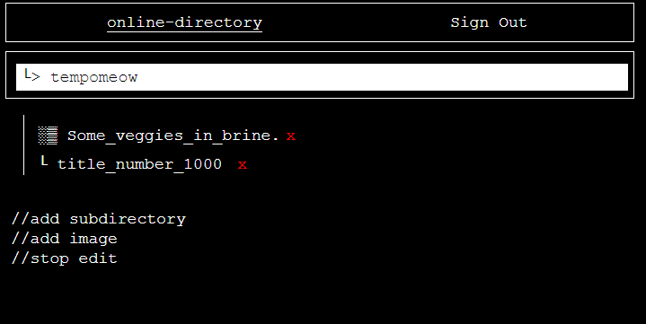

# online-directory

My goal for this project was to have a place to share and write about my many passions and to be able to organize them using a directory style system in an app. 

Users can view other's directories and when logged in, modify and add to their own. 

In the homepage, if the server has spun down, it needs to first spin back up which takes about 50 seconds. 

Then the users list loads and we can click on one to view their directory.

We can then view their subdirectories and documents.

Then by clicking the Sign In button, users can create an account and sign in. 

Once signed in, we can click on edit in our directory to add subdirectories, add images to the current directory, or delete things.

After uploading an image we can add some text to accompany it.

